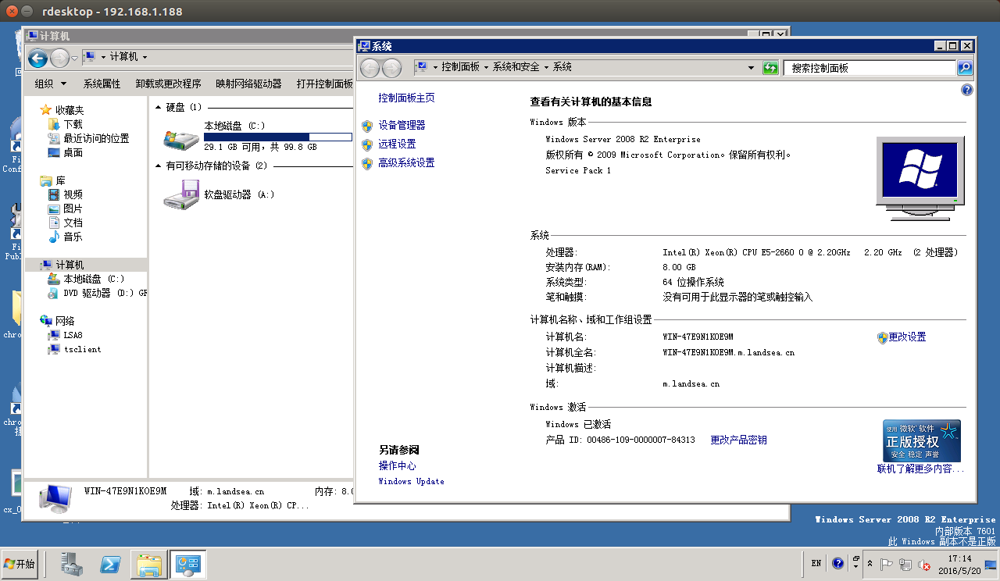
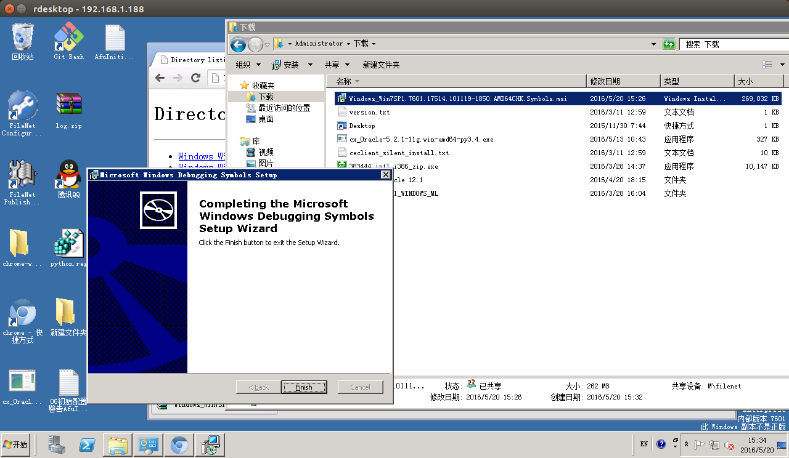
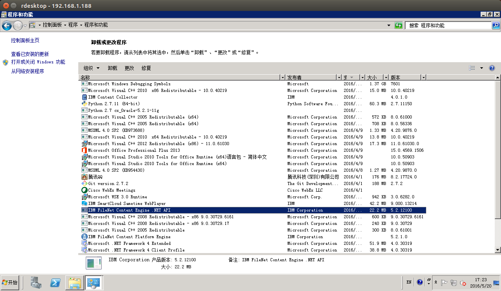
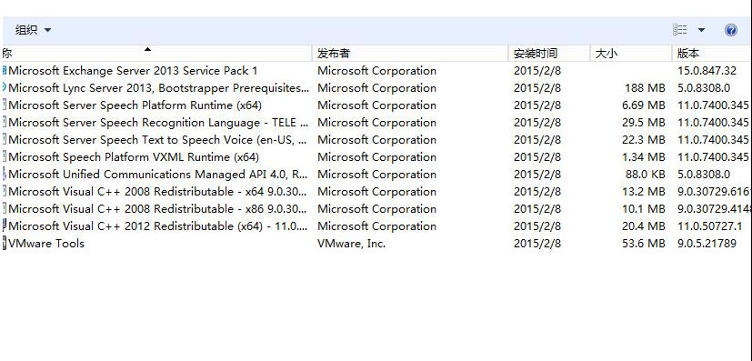

# ICC安装需求检测

## Hardware requirements
* CPU要求: 2 核 2.5 GHz; 实际: 8CPU 2.2 GHz **不满足**
* 内存要求: 4 GB; 实际: 8 GB **满足**
* 硬盘要求: 150GB; 实际: 100GB **不满足**
* 系统要求: Microsoft 2008 R2; **满足**

## Operating system
* 操作系统: Windows Server 2008 R2 with Service Pack 1; **满足**

## Required software
* FileNet Content Engine .NET and Java clients **.NET API在程序列表里面, Clients不确定是不是是那个IBM FileNet Content Platform Engine**

## WebSpherre Application Server
* 需要 8.0.0.11 或者 8.5 实际: 8.5 **满足**

## Exchange
* 需要exchange server 2013 Service Pack 1   **满足**

## Filenet
* 需要 5.2.1 实际: 5.2.1 **满足**

